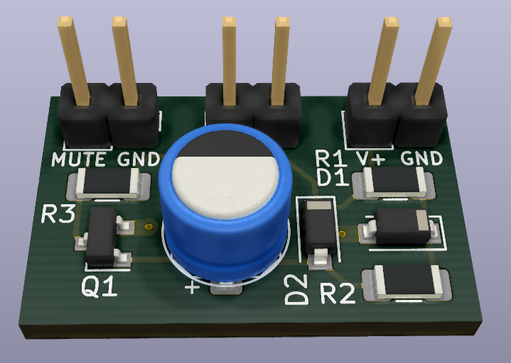
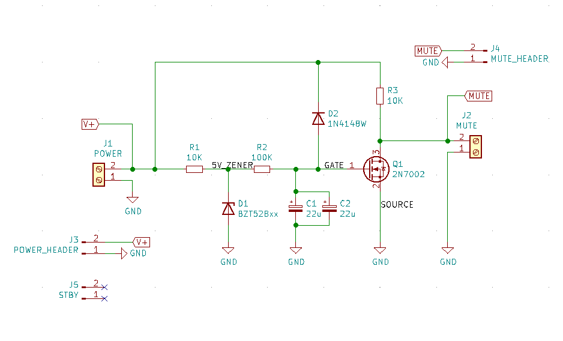
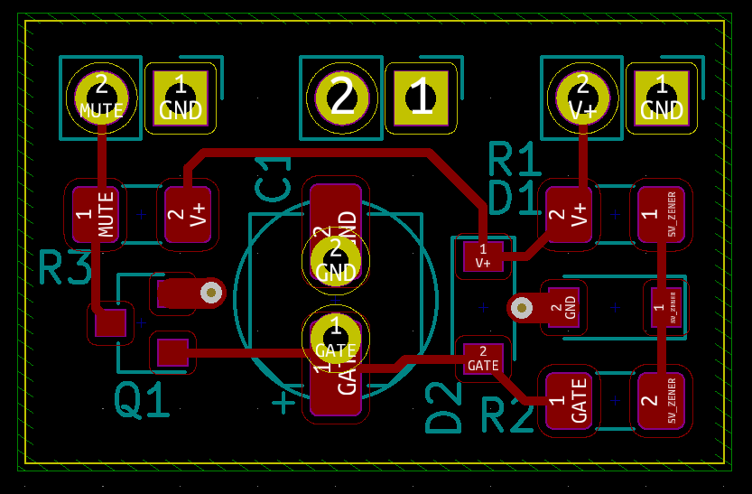

# LM1876 mute delay

Circuit mutes LM1876 for 1 sec upon powering on. 

From the datasheet, if a logic high (1.5 to 5V) is applied to the MUTE pin, the amp will be muted.

The goal is to mute the amp during the turn on (and turn off). For that a logic high needs to be applied to the MUTE pin when amp is turned on, but after 1 or 2 seconds wait time the MUTE pin should be pulled low (< 1.5V).

Simple circuit that achieves the goal consists of:
* 5V zener regulator
* RC time delay
* NOT logic gate

Power is taken from the positive rail of the amp's power supply that is 20V to 25V.

Zener regulator resistor is selected at 10K, and it pulls ~2mA of current. Another 10K resistor is at the drain of the FET and pulls another ~2mA resulting in total current draw of ~4mA.

## PCB rendered in 3d:

## Schematics
Only one 22uF capacitor needs to be used.

## PCB layout

Headers can be directly connected on top of the amplifier board in my other repository for LM1876 board.

## LTSpice simulation

